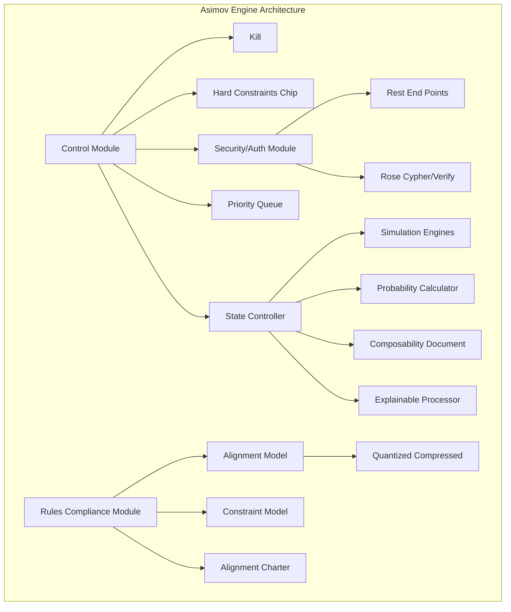

# SuperIntelligence : Asimov Engine

```mermaid
flowchart TD
    subgraph Asimov Engine Architecture
        A[Control Module] --> B[Kill]
        A --> C[Hard Constraints Chip]
        A --> D[State Controller]
        A --> E[Priority Queue]
        A --> F[Security/Auth Module]
        F --> G[Rest End Points]
        F --> H[Rose Cypher/Verify]
        D --> I[Simulation Engines]
        D --> J[Probability Calculator]
        D --> K[Composability Document]
        D --> L[Explainable Processor]
        M[Rules Compliance Module] --> N[Alignment Model]
        N --> O[Quantized Compressed]
        M --> P[Constraint Model]
        M --> Q[Alignment Charter]
    end

```
