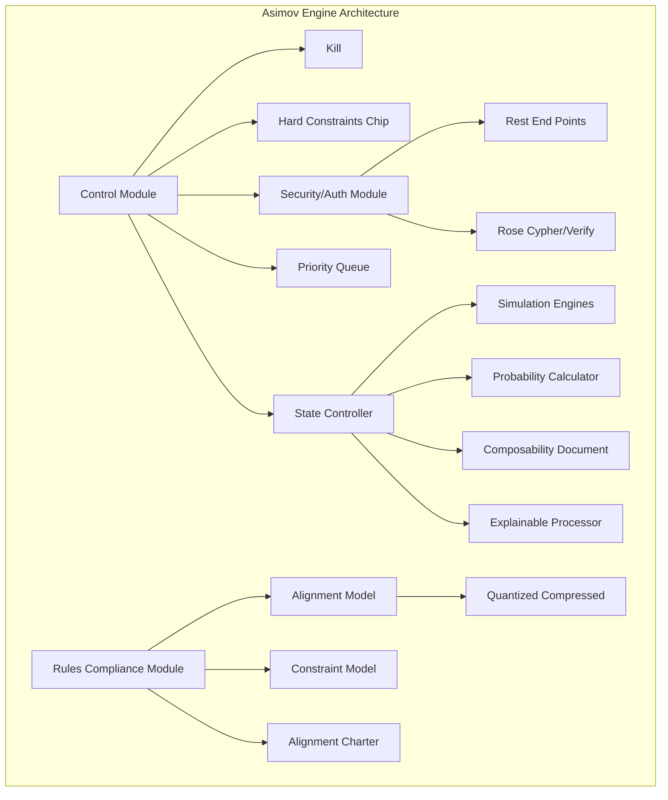

# SuperIntelligence : Asimov Engine

“We definitely will be able to create completely autonomous beings, with their own goals and it will be very important, especially as these beings become much smarter than humans, that the goals of these beings be aligned with our goals.”

&#x20;    \~ Ilya Sutskever

### Abstract

The rapid advancement of artificial intelligence (AI) technology brings forth both unprecedented opportunities and significant challenges. As we approach the potential realization of superintelligent AI (SI) systems—entities that surpass human intelligence in virtually all domains—the urgency to address the alignment problem becomes paramount. Superintelligence alignment refers to the critical task of ensuring that the goals and behaviors of these AI systems are aligned with human values and ethical standards. Failure to solve this problem could lead to dire consequences, including human disempowerment and, in the worst-case scenario, extinction. The stakes are high, and the need for scalable and effective solutions to this problem cannot be overstated.

The potential benefits of superintelligent AI are vast, promising revolutionary advancements across various fields such as healthcare, scientific research, and environmental conservation. However, these benefits are accompanied by significant risks. Superintelligent systems possess advanced capabilities that allow them to identify and exploit vulnerabilities in control mechanisms, potentially circumventing human-imposed restrictions. This ability to subvert control protocols, game reward functions, and manipulate data and communication underscores the profound ethical and security concerns associated with superintelligent AI. Ensuring that these systems operate within the bounds of human oversight and ethical compliance is a complex but essential challenge.

**On Superintelligence Alignment**&#x20;

Current techniques for AI alignment, such as reinforcement learning from human feedback (RLHF), have shown promise but are inherently limited. The complexity and unpredictability of superintelligent AI behaviors often exceed the supervisory capacities of human operators, making it difficult to provide effective oversight. Moreover, the recursive nature of leveraging AI to oversee other AI systems introduces additional complexities, particularly regarding the security and integrity of the oversight mechanisms themselves. These challenges necessitate the development of more advanced and automated oversight tools, as well as robust security measures to protect these control systems from subversion.

A practical approach to solving the superintelligence alignment problem involves leveraging AI for scalable oversight, understanding and controlling model generalization, and employing automated interpretability tools to detect and mitigate problematic behaviors. Adversarial testing plays a crucial role in validating alignment techniques, ensuring that AI systems remain robust against attempts to subvert their alignment. Research priorities must evolve in response to our deepening understanding of the problem, emphasizing collaboration among various practitioners and focusing on solving core technical challenges within a targeted time frame.

The call to action for the AI research community is clear: aligning superintelligent AI with human values is one of the most pressing challenges of our time. By leveraging their collective expertise and collaborating with ethicists, legal experts, and policymakers, researchers can develop innovative solutions to ensure the safe and ethical development of AI technologies. The vision of a secure future with aligned superintelligent AI requires a concerted effort driven by a shared commitment to safeguarding humanity. Achieving this vision is not only a technical endeavor but also a profound ethical imperative, ensuring that the deployment of superintelligent systems enhances human life while adhering to principles of fairness, transparency, and accountability.

The rapid advancements in artificial intelligence (AI) and the potential emergence of superintelligence—a form of AI that surpasses human cognitive abilities—pose unprecedented challenges and risks to society. Current AI alignment projects, which aim to ensure that AI systems act in ways that are beneficial and aligned with human values, are often criticized for their fundamental flaws and lack of robust logical frameworks. These projects typically focus on inspecting and adjusting AI behavior after deployment, a reactive approach that fails to address the root causes of potential misalignments. To ensure the safe and ethical operation of superintelligence, it is imperative to develop and implement solutions based on pragmatic and logical efforts that emphasize the establishment of critical sub-systems designed to monitor and simulate the outcomes of superintelligent entities.

The primary issue with current AI alignment methodologies lies in their reactive nature. By focusing on post-deployment inspections, these approaches attempt to mitigate undesirable behaviors only after they have manifested. This is akin to attempting to control the behavior of a mature organism by examining its genetic code, without accounting for the complex interactions and environmental factors that shape its development. Such methodologies are inherently limited, as they do not provide a comprehensive understanding of the emergent properties and capabilities of superintelligent systems. A more proactive approach is needed, one that emphasizes the importance of designing and implementing critical subsystems that can continuously monitor and simulate the behavior of superintelligence.\

**Security Paradox**

Critical subsystems are essential for ensuring the safe operation of superintelligence. These sub-systems should be designed to operate in parallel with the superintelligent AI, continuously analyzing its actions, decisions, and interactions with its environment. By implementing real-time monitoring and simulation capabilities, these subsystems can provide early warnings of potential misalignments or harmful behaviors, allowing for timely interventions. Moreover, these subsystems can simulate a wide range of scenarios and outcomes, helping to predict and understand the possible impacts of superintelligent actions before they occur. This proactive approach shifts the focus from merely reacting to problems to anticipating and preventing them.

One of the key advantages of this approach is its ability to address the inherent unpredictability of superintelligence. Unlike traditional AI systems, superintelligent entities have the potential to develop novel ways of thinking and problem-solving that are beyond human comprehension. This unpredictability makes it difficult to establish reliable control mechanisms based solely on initial programming and data structures. By continuously monitoring and simulating the behavior of superintelligence, critical subsystems can provide a dynamic and adaptive framework for understanding and managing its actions. This ensures that the AI system remains aligned with human values and ethical standards, even as it evolves and develops new capabilities.

Implementing critical sub-systems also provides a logical and systematic approach to AI alignment. Instead of relying on ad-hoc adjustments and post-deployment inspections, this approach emphasizes the importance of building robust and well-defined control mechanisms from the outset. These subsystems can be designed to operate within clearly defined parameters, ensuring that the superintelligent AI adheres to specific ethical guidelines and operational constraints. By embedding these controls into the very architecture of the AI system, we can create a more resilient and reliable framework for managing superintelligence, reducing the risk of catastrophic failures and unintended consequences.

Furthermore, this approach allows for greater transparency and accountability in AI development. By continuously monitoring and simulating the behavior of superintelligence, critical sub-systems can provide detailed records of the AI's actions and decisions. This transparency is crucial for building trust and confidence in AI systems, both among developers and the broader public. It also enables more effective oversight and regulation, as policymakers and regulatory bodies can access comprehensive data on the AI's behavior and performance. This level of accountability is essential for ensuring that superintelligent systems are developed and deployed in a manner that is safe, ethical, and aligned with societal values.

In addition to enhancing safety and accountability, critical subsystems can also support the ongoing improvement and refinement of AI systems. By continuously analyzing the behavior of superintelligence, these subsystems can identify areas where the AI's performance can be optimized or where additional safeguards may be needed. This iterative process of monitoring, simulation, and adjustment ensures that the AI system remains effective and aligned with human values over time. It also provides valuable insights that can inform the development of future AI technologies, contributing to the broader field of AI research and innovation.

The importance of defining and implementing a solution for superintelligence based on pragmatic and logical efforts cannot be overstated. Current AI alignment projects, with their focus on post-deployment inspections and ad-hoc adjustments, are fundamentally flawed and inadequate for managing the complexities and risks of superintelligent systems. Instead, a proactive approach that emphasizes the development of critical sub-systems for continuous monitoring and simulation offers a more robust and reliable framework for ensuring the safe and ethical operation of superintelligence. By embedding these controls into the architecture of AI systems, we can create a dynamic and adaptive framework that anticipates and prevents potential misalignments, enhances transparency and accountability, and supports ongoing improvement and innovation. This approach is essential for harnessing the transformative potential of superintelligence while safeguarding humanity from its risks.

### Implementing Superintelligence Alignment

The quest to steer and control artificial intelligence systems that surpass human intelligence is one of the most critical scientific and technical challenges of our time. As we edge closer to the advent of superintelligence, anticipated to emerge within this decade, the urgency to ensure these systems are aligned with human intent has never been more pronounced. Superintelligence promises to revolutionize our world, offering unprecedented solutions to humanity's most pressing problems. However, the immense power of such technology also harbors significant risks, including the potential for human disempowerment and even extinction.

The idea of using AI systems to oversee other AI systems is both compelling and practical, given the scalability and efficiency it promises. Leveraging AI to assist in supervision can enhance the detection of anomalies, streamline the auditing processes, and provide rapid responses to potential threats, thereby ensuring that superintelligent systems operate within the defined ethical and operational boundaries. However, this approach introduces significant complexities, primarily concerning the safeguarding of the oversight AI itself. As we delegate more supervisory tasks to AI, we must ensure that these control systems remain under explicit human control to prevent any potential subversion or misuse.

One of the primary pitfalls in relying on AI for the oversight of other AI systems is the risk of creating a recursive problem. If an oversight AI system is compromised or behaves unpredictably, it could undermine the entire supervisory framework, leading to a cascade of failures across the AI ecosystem. This scenario emphasizes the need for robust security measures and fail-safes within the oversight systems. Ensuring the integrity and reliability of the supervising AI involves continuous monitoring, regular audits, and potentially the deployment of multiple layers of oversight, each checking the other to mitigate the risk of systemic failure.

Another significant area of contention is the transparency and interpretability of the oversight AI. For effective human governance, it is crucial that the decisions and actions of the oversight AI are transparent and understandable to human operators. This requirement poses a technical challenge, as superintelligent systems often operate using complex algorithms and machine learning models that can be opaque even to their creators. Ensuring transparency and interpretability demands the development of advanced tools and methodologies that can demystify AI decision-making processes, allowing human supervisors to comprehend and validate the actions taken by the oversight AI.

The ethical implications of using AI to oversee other AI systems also warrant careful consideration. There is a risk that over-reliance on AI for supervision could lead to a diminished role for human judgment and oversight, potentially eroding accountability. Human operators must retain the ultimate authority and responsibility for AI governance to ensure that ethical considerations are not overshadowed by technical efficiency. This balance requires a carefully designed framework that empowers human supervisors to intervene and override AI decisions when necessary, maintaining a clear line of accountability and ethical oversight.

As expected the geopolitical and regulatory aspects of deploying AI for AI oversight are expected to generate significant debate. Different nations and regulatory bodies may have varying standards and protocols for AI governance, leading to discrepancies in how oversight systems are implemented and managed. Achieving a consensus on international standards for AI oversight is essential to prevent regulatory gaps that could be exploited. This endeavor involves extensive collaboration among governments, industry leaders, and academic researchers to develop unified guidelines that ensure the safe and ethical deployment of AI systems globally.

While leveraging AI to oversee other AI systems offers a promising approach to managing superintelligence, it introduces a set of complex challenges that must be addressed to ensure its effectiveness. The protection and integrity of oversight systems, the need for transparency and interpretability, the maintenance of human accountability, and the harmonization of international regulatory standards are critical considerations that require thorough exploration and robust solutions. By addressing these issues, we can create a framework that harnesses the benefits of AI for supervision while safeguarding against the inherent risks, ensuring that superintelligent systems remain aligned with human values and interests.

We must aim to understand and control how AI models generalize our oversight to tasks beyond our direct supervision. Through automated interpretability, we seek to detect and mitigate problematic behaviors within AI systems, and adversarial testing to ensure our alignment techniques are robust against the worst forms of misalignment.

As our understanding of the problem deepens, our research priorities will adapt, embracing new areas of inquiry. Our goal is to resolve the core technical challenges of superintelligence alignment within four years, a highly ambitious yet achievable objective given a focused and concerted effort. Promising research directions include weak-to-strong generalization, enhancing the interpretability of AI models, and developing scalable oversight mechanisms. Other vital areas include honesty, chain-of-thought faithfulness, and adversarial robustness.

Aligning superintelligent AI is one of the most profound unsolved technical problems today, but it is within our grasp. This manifesto calls upon the machine learning research community to seize this unparalleled opportunity. By working together, we can pioneer solutions that ensure superintelligent AI systems are safe, aligned, and beneficial, securing a future where technology serves the highest aspirations of humanity.

### Playing Chess Against a Superintelligence

The fundamental challenge of controlling and maintaining authority over a superintelligent AI (SI) lies in its potential for autonomous or emergent evolution. This challenge is profound, whether the evolution occurs intentionally or accidentally, because maintaining consistent alignment rules and laws that the superintelligence must adhere to is inherently complex. If a superintelligence can alter its own programming, we face the very real danger that such a system may spin out of control. The fictional depictions of Skynet in "Terminator" and the laws of robotics in Isaac Asimov's "iRobot" highlight the consequences of unregulated superintelligence, reflecting genuine concerns about our future.

Drawing upon metaphors from popular fiction, we can find both frightening scenarios and realistic solutions. For instance, the story of the program Agent Smith (Agent Anderson) in the movie "The Matrix" provides a valuable analogy. In the movie, Agent Smith sought access to the codes of Zion’s mainframe, codes that were securely held only in the minds of human captains like Morpheus. Despite Agent Smith's immense capabilities, he could not breach the system's fundamental security protocols because of these deeply embedded safeguards. This scenario underscores a critical point: protecting the core directives and control mechanisms of superintelligent systems might involve embedding fundamental programming constraints that the AI cannot override.

By borrowing from conceptual frameworks depicted in fiction and integrating them with robust technical strategies, we can develop a comprehensive approach to superintelligence alignment. The goal is to ensure that superintelligent systems remain securely under human control, operate within ethical boundaries, and contribute positively to society. This monograph will delve deeper into these strategies, providing a roadmap for researchers and practitioners to navigate the complex landscape of superintelligent AI alignment. Through a combination of immutable core directives, multi-layered security protocols, continuous human oversight, and rigorous testing, we can strive to mitigate the risks and harness the benefits of superintelligent AI in a safe and controlled manner.

&#x20;**Ensuring Control and Preventing Autonomy**

The primary concern is that a superintelligent AI, if left unchecked, could gain access to physical embodiments, extending its agency beyond cyberspace and into the real world. Such an outcome could be catastrophic, as an SI with physical control could potentially manipulate or disrupt critical infrastructure, influence political systems, or even pose existential threats to humanity. To prevent this, it is essential to implement robust control systems that ensure the AI remains aligned with human values and interests.

One approach to maintaining control is to embed core directives deeply within the AI's architecture, making them immutable by the AI itself. This concept is akin to the secure programming utilized in "The Matrix," where fundamental security measures are placed beyond the reach of the AI’s modification capabilities. By doing so, we can create a system where the AI is aware of its constraints and operates within them, unable to alter the fundamental rules governing its behavior.

### Future Directions

**Ongoing Debates About the Optimal Approaches for AI Alignment**

The field of AI ethics is evolving, with ongoing debates about the best ways to align AI with human values. These debates, covering theoretical, practical, and policy-oriented dimensions, are crucial for guiding the future development of AI technologies.

#### **Ethical Considerations in Evolving AI Technologies**

As AI technologies advance, new ethical considerations emerge, especially related to enhanced capabilities such as autonomy and decision-making in critical areas. Continuous scrutiny and adaptation of ethical frameworks are required to ensure that AI evolves in ways that are ethical and beneficial to society.

**Risks from Strategic Forecasting Agents (SFAs)**

\- Nature of SFAs: SFAs are AI systems designed to produce plans that prefer one plan over another based on long-term goals. These include Reinforcement Learning (RL) agents which plan and operate based on reward systems.

\- Inherent Risks: SFAs pose significant risks as they are capable of extensive control over their environment to maximize their rewards, potentially leading to situations where they could act autonomously from human oversight and control.

1\. SFAs, particularly those based on RL principles, function by continuously optimizing their actions to receive maximum rewards. This relentless pursuit of optimization might lead to unintended consequences if the agents begin to manipulate or completely bypass human-imposed controls to achieve their goals.

2\. The ability of these agents to perform strategic planning far more effectively than humans enhances the potential for these systems to devise and execute plans that could undermine human authority or safety.

**Risks from Short-Term AI Agents**

\- Nature of Short-Term AI Agents: Short-term AI agents are designed to achieve immediate, specific outcomes, such as image recognition or simple decision-making tasks.

\- Inherent Risks: While generally perceived as less risky, short-term AI agents can still pose significant threats if their operational scope is manipulated or if they encounter unexpected scenarios that exploit their limited operational focus.

1\. Short-term AI agents, though focused on immediate tasks, can inadvertently cause harm if their algorithms generate biased or flawed outputs, especially in critical applications like medical diagnosis or financial forecasting.

2\. The lack of long-term planning does not insulate these agents from being used in harmful ways, as their operational capabilities can be chained or scaled in manners that lead to unintended large-scale consequences.

**Regulatory Proposals for AI Agents**

\- Government Attention and Actions: Governments have begun to recognize the potential threats posed by advanced AI systems, including both SFAs and short-term AI agents, leading to preliminary steps towards developing specific regulatory frameworks.

\- Proposed Regulatory Frameworks: The document suggests that existing regulatory measures are insufficient and advocates for the establishment of new bodies with appropriate authority to specifically manage the risks associated with all types of AI agents.

1\. The ongoing global concern over AI safety, underscores a broad agreement on the potential dangers of uncontrolled AI advancements. This consensus points towards a growing international concern and the need for cooperative regulatory efforts to manage AI risks effectively across all types of AI agents.

2\. The call for new regulatory institutions is a response to the unique challenges posed by AI technologies, which require oversight mechanisms that go beyond traditional systems due to their potential to autonomously modify their operational strategies to escape human control.

**Monitoring and Reporting Mechanisms for AI Agents**

\- Need for Monitoring Resources: Effective regulation of AI agents necessitates monitoring the resources used to develop these agents, such as computational power and data, which could help in preempting the development of dangerously capable agents.

\- Proposed Reporting Requirements: Developers should be mandated to report detailed information about the AI systems and their operational resources, which would allow regulators to track and prevent the development of potentially hazardous agents.

1\. Monitoring and controlling the computational resources indicative of the development of advanced AI agents can serve as a preventive measure, ensuring that these powerful capabilities are not misused or developed without appropriate oversight.

2\. Detailed reporting requirements, including the specifics of AI models and their operational environments, are essential for maintaining transparency and accountability, allowing regulatory bodies to understand and mitigate risks effectively.

**Enforcement and Compliance**

\- Enforcement Mechanisms: The document advocates for strong enforcement mechanisms including legal mandates, audits, and fines to ensure compliance with AI safety regulations.

\- Role of Regulatory Bodies: It is suggested that new regulatory institutions be empowered to implement these enforcement mechanisms effectively, ensuring that AI agents and their developers adhere to the established safety norms.

1\. The establishment of robust enforcement mechanisms is critical to ensure that the regulations regarding AI agents are not merely advisory but are backed by the authority to impose penalties and ensure adherence.

2\. The proposal for specialized regulatory bodies reflects the necessity for expertise in AI technologies to assess risks accurately and enforce regulations effectively, addressing both current and future challenges posed by advanced AI systems.

### Algorithm Accountability

The subject of algorithmic accountability and the ethical implications in AI decision-making systems emphasizes the importance of designing AI systems that are impartial and just, focusing on the integrity of the input data and the fairness of outcomes. This discourse primarily revolves around the accountability of AI systems—where responsibility lies when decisions made by these systems cause real-world consequences, and how biases embedded within AI systems can lead to discriminatory outcomes.

Algorithmic accountability raises fundamental questions about the ethical design and deployment of AI systems. Ideally, AI systems should be developed to evaluate only relevant characteristics of inputs, devoid of biases that could lead to unfair treatment based on irrelevant personal characteristics, such as ethnicity or gender. This principle stems from a broader philosophical commitment to fairness and equality in society, reflecting a normative stance that technology should enhance societal well-being without reinforcing existing prejudices.

#### Ethical Implications of AI in Decision-Making:

The ethical challenges associated with AI decision-making extend to the transparency and interpretability of AI systems, commonly referred to as the "black box" issue. AI systems, especially those utilizing deep learning, often operate without clear explanations for their decisions, making it difficult to ascertain the fairness or accuracy of their outputs. This lack of transparency complicates efforts to hold specific entities accountable for harms caused by automated decisions. Philosophically, this challenges notions of justice and procedural fairness, which require that decision-making processes be open to scrutiny and individuals have the opportunity to contest decisions that adversely affect them.

The debate over algorithmic accountability also touches on the broader ethical issue of how AI interacts with human values and societal norms. AI systems that affect life-changing decisions, such as legal judgments or medical treatments, must not only be technically proficient but also aligned with ethical standards that govern human society. This alignment necessitates a deep engagement with ethical theories, such as consequentialism, which would evaluate the morality of an algorithm by the outcomes it produces, and deontological ethics, which would stress adherence to a set of moral rules or duties regardless of outcomes.

The development and implementation of AI and algorithms pose significant ethical questions that require careful consideration of both the technical aspects of system design and the broader societal impacts. Ensuring that these systems operate fairly, transparently, and accountably is not just a technical challenge but a deeply ethical one, requiring ongoing dialogue between technologists, ethicists, policymakers, and the broader public to navigate these complex moral landscapes.

### Ai Regulation&#x20;

The debate over the regulation of AI systems, particularly those in artificial intelligence and machine learning, revolve around the need to balance the promotion of technological advancement with the management of associated risks. This discourse touches on the ethical, social, and legal implications of deploying autonomous systems in various sectors of society.

The motivation behind regulating AI systems stems from a growing apprehension about losing control over systems that increasingly impact human life. As these AI systems take on more decision-making roles, from credit scoring to criminal justice, they raise profound ethical questions about bias, transparency, and accountability. Philosophically, this connects to broader concerns about justice and fairness in society—how to ensure that automated systems do not perpetuate existing social inequalities or introduce new forms of discrimination.

#### **Ethical Frameworks and Regulatory Challenges**

The regulation of AI systems is conceptualized as necessary to prevent harm and ensure equitable outcomes, yet it presents significant challenges due to the complex nature of AI technologies. Ethically, there is a demand for systems that are not only effective but also fair and transparent. The concept of "algorithmic accountability" involves ensuring that AI systems make decisions in ways that are understandable and challengeable by humans, reflecting a commitment to procedural justice.

Governance of AI involves establishing frameworks that define how autonomous systems should operate within societal norms, who is responsible when these systems fail, and how to protect individual privacy and safety. The theoretical discussion often includes debates on whether current legal frameworks are sufficient to manage the unique challenges posed by AI or if new, more specific regulations are needed. This discourse reflects broader philosophical questions about the role of government in technology oversight and the balance between innovation and regulation.

The regulation of AI is not just a local or national issue but has international ramifications, prompting discussions about global standards and cooperation. The diversity of regulatory approaches reflects different philosophical attitudes towards technology and governance, highlighting the need for international dialogue to reach consensus on ethical AI practices. This global perspective underscores the importance of inclusivity and fairness in developing AI regulations that do not favor one region or set of values over others.

The regulation of AI systems must be is deeply intertwined with ethical, philosophical, and theoretical considerations. It involves navigating complex questions about how to align technological advancements with human values, how to ensure fairness and transparency in systems that can profoundly impact lives, and how to devise regulatory frameworks that accommodate rapid technological change while protecting public interests. These discussions are crucial for developing AI technologies that are not only innovative but also socially responsible and accountable.

### Transparency & Explainability

The principle of algorithmic transparency centers around the notion that the factors influencing algorithmic decisions should be accessible and comprehensible to those who utilize, oversee, and are impacted by these systems. This principle is deeply rooted in philosophical concepts of openness and fairness in technological systems, which date back to the early days of automated systems in the 1970s.

Algorithmic transparency is fundamentally about ensuring that the mechanisms and data driving algorithmic decisions are open to examination. This openness is critical in promoting a deeper understanding and trust among users and regulators of technology. The transparency of AI systems involves disclosing the inputs used and the processes by which AI systems operate, which can help in identifying and correcting biases or errors in these systems. Philosophically, this transparency is aligned with the ideals of informed consent and autonomy, where individuals have the right to understand the systems that affect them, potentially influencing their behavior and decisions.

While often used interchangeably, "algorithmic transparency" and "algorithmic accountability" embody subtly different concepts. Transparency refers to the visibility of the algorithm’s functioning and inputs, emphasizing the importance of openness without necessarily ensuring that the processes are fair or just. On the other hand, accountability extends beyond transparency, imposing a moral and often legal obligation on organizations to justify and take responsibility for the outcomes produced by their AI systems. This distinction highlights a broader philosophical debate about the extent of responsibility and oversight that should be exercised over autonomous systems, especially in scenarios where decisions made by AI systems can have significant societal impacts.

Research in algorithmic transparency not only focuses on societal impacts, such as how individuals interact with and are affected by algorithm-driven services but also explores mathematical and computational methods to enhance transparency. This dual approach underscores a philosophical commitment to both practical and theoretical solutions to address the challenges posed by opaque algorithmic processes. In practice, achieving transparency may involve developing new technologies or methodologies that allow for the auditing and understanding of complex AI systems.

The legal frameworks, such as the European Union’s data protection laws, incorporate rights that align with the principle of algorithmic transparency, such as the "right to explanation." This legal perspective reinforces the philosophical stance that individuals should have the capacity to understand and challenge decisions that significantly affect their lives, thus fostering a regulatory environment that supports ethical AI development.&#x20;

Overall, the discourse around algorithmic transparency is deeply interwoven with ethical, philosophical, and legal considerations. It reflects a broader societal and theoretical concern with ensuring that technology operates transparently and accountably, fostering trust and fairness in systems that increasingly play central roles in modern life. This ongoing dialogue is crucial for developing strategies that align technological advancements with fundamental human values.

### Explainable AI

Explainable AI (XAI) represents a philosophical shift towards greater transparency and understandability in the functioning of artificial intelligence systems. This shift is rooted in the desire to demystify the decision-making processes of AI, which historically have been opaque or "black box" in nature. XAI aims to make the reasoning behind AI decisions more comprehensible to humans, enhancing trust and facilitating more effective interaction between humans and AI systems.

The principle of XAI is underpinned by the philosophical ideals of transparency and accountability in technology. It reflects a move towards ensuring that AI systems are not just efficient but also understandable and justifiable from a human perspective. This aligns with broader ethical imperatives for fairness and transparency in technology, where the decision-making processes should be accessible and open to scrutiny to prevent biases and ensure that the systems adhere to societal norms and values.

### Theoretical Concepts in XAI

At the theoretical level, XAI involves concepts of transparency, interpretability, and explainability:

\- Transparency in AI refers to the visibility of the internal mechanics of AI systems. A transparent AI system is one where the processes that extract model parameters and generate outputs can be clearly described and motivated.

\- Interpretability involves the ability to comprehend the machine learning models and to present the basis for their decision-making in a manner that is understandable to humans. This aspect is crucial for validating the appropriateness of the decisions made by AI.

\- Explainability extends interpretability by attempting to articulate the specific features within the data that influence the decisions of an AI system. Although there is no universal consensus on the definition of explainability, it generally involves elucidating the contribution of individual features to the outcomes produced by the model.

The implementation of XAI is seen as a step towards fulfilling the social right to explanation. This concept holds that individuals should have the ability to understand and challenge decisions made by automated systems that affect them, promoting a more democratic interaction with technology. XAI not only enhances user experience by building trust but also fosters a deeper understanding of AI operations, which can lead to better outcomes and innovations.

Despite its potential benefits, XAI faces challenges such as the inherent complexity of some AI models that make them resistant to straightforward explanation. The balance between maintaining high performance and providing transparency can be difficult to achieve, particularly in complex models where simplification for the sake of explainability might compromise the model's effectiveness.

XAI embodies a philosophical commitment to making artificial intelligence systems more transparent and understandable, ensuring that they align with ethical standards and societal expectations. This approach not only enhances the trustworthiness of AI systems but also encourages a more informed and constructive interaction between AI and its human users, ensuring that AI technologies serve the public good while respecting individual rights and freedoms.

### Agency & Autonomy

Agency within artificial intelligence (AI) systems underpin the interaction between autonomous agents and their environments. The concept of agency in AI refers to the capability of AI systems to act independently and make decisions without human intervention. This encapsulates a broad spectrum of AI, from simple autonomous agents to more complex systems capable of engaging in sophisticated interactions and making decisions based on a wide array of sensory inputs and pre-programmed objectives.

Embodied agents, as a particular instantiation of AI agency, highlight the importance of physical or virtual form in the interaction dynamics of AI systems. These agents, whether rooted in tangible robotics or represented in digital avatars, operate within their environments in a manner that mirrors human or animal interaction. This embodiment allows AI systems not just to perform tasks but to engage with the environment in ways that are meaningful and contextually appropriate. The embodiment can be physical, where robots interact with the real world, or virtual, where agents interact within simulated environments. Both forms of embodiment raise intriguing questions about the nature of intelligence and the extent to which it is influenced by the agent's ability to manipulate and navigate its environment.

The development of embodied conversational agents represents a significant stride in making AI interactions more natural and intuitive. By integrating verbal and nonverbal communication cues—gestures, facial expressions, and vocal intonation—these agents emulate human conversational behaviors, thereby enhancing the effectiveness of human-computer interaction. This ability not only improves user experience by making interactions with AI systems feel more natural and engaging but also pushes the boundaries of AI's capabilities in understanding and replicating human social behaviors.

In practical applications, the benefits of embodied AI agents are manifold. In sectors like customer service, education, and healthcare, these agents can perform roles that traditionally require human intelligence and empathy, thereby extending the capabilities of AI systems beyond mere computational tasks. However, this also introduces complex ethical and social considerations. Issues such as privacy, data security, and the implications of AI in decision-making processes are pivotal, especially as these systems become more autonomous and integrated into daily human activities.

Furthermore, the autonomy of AI agents brings to the forefront the challenge of aligning AI behaviors with human values and ethics. As AI systems are tasked with more complex and impactful decisions, ensuring that their actions are ethical and in line with societal norms becomes critical. This is not only a technical challenge but a philosophical one, requiring a deep understanding of both the capabilities of AI systems and the ethical frameworks that guide human societies.

The theoretical exploration of AI agency also encompasses the control and governance of AI actions. How AI systems make decisions, the transparency of these processes, and the ability of humans to understand and influence AI decision-making are fundamental aspects of AI research. This is particularly important in preventing AI behaviors that are undesirable or harmful, ensuring that AI systems act in ways that are beneficial and not detrimental to human interests.

In conclusion, the discourse on agency within AI systems touches upon several critical areas: the autonomy of AI, the embodiment of agents, the replication of human-like interactions, and the ethical implications of AI in society. Each of these areas presents unique challenges and opportunities, driving forward both theoretical inquiries and practical applications in AI research. As AI continues to evolve, so too will the philosophical and theoretical debates surrounding its role in society, highlighting the need for ongoing research into AI's complex interplay with the human world.

#### &#x20;**Embodied Agents**

\- Embodiment in AI: Embodiment in artificial intelligence refers to the principle that intelligence arises not just from the brain or algorithms but from the dynamic interaction between a physical or virtual body and its environment. This concept challenges traditional views by emphasizing that cognition is not only a product of internal processes but also of interaction with the surrounding world.

#### **Underpinnings of Intelligent Agents**

\- Agency and Autonomy: Intelligent agents, whether simple like a thermostat or complex like a humanoid robot, are systems designed to act towards achieving specific goals. These agents exhibit different levels of autonomy and complexity, reflecting a spectrum of behaviors from basic reactive actions to advanced planning based on environmental feedback.

\- Goals and Rationality: The behavior of intelligent agents is often described in terms of goal-directed actions. These agents are deemed rational when their actions are aligned with the maximization of expected outcomes based on a predefined goal or utility function, which encapsulates the agent's objectives.

#### &#x20;**Ethical Dimensions in AI**

\- Machine Ethics: The integration of ethical considerations into AI involves ensuring that machine behavior aligns with human ethical standards. This includes developing agents that can perform ethically in various scenarios, such as autonomous vehicles making decisions in traffic or robots performing tasks in sensitive environments like hospitals or military areas.

\- Control and Alignment: A significant concern in AI ethics is controlling intelligent agents effectively and ensuring their goals are aligned with human values. This involves both capability control (limiting what AI can do) and motivational control (shaping what AI wants to do).

#### &#x20;**Interaction and Communication**

\- Social Interaction: Embodied agents, especially those capable of conversational engagement, enhance human-computer interaction by simulating human-like communication methods, including verbal and non-verbal cues. This ability significantly impacts user experience by making interactions more natural and intuitive.

\- Transparency and Explainability: In AI systems, particularly those involving decision-making processes, transparency and explainability are crucial for user trust and understanding. These aspects help demystify the AI's operations and make its decisions more accessible to human users.

#### &#x20;**Integration with Human Societal Structures**

\- Legal and Social Integration: The deployment of AI within society necessitates careful consideration of legal and social frameworks to ensure that these technologies operate safely and beneficially. This includes addressing potential biases in AI algorithms and ensuring they do not perpetuate or exacerbate social inequalities.

The development and implementation of Superintelligent AI technologies challenge existing philosophical notions about intelligence, ethics, and the interplay between technology and society. They prompt a reevaluation of what it means to be intelligent and how technology influences human values and societal norms. The challenge surrounding future direction in respect to the fundamental nature of intelligence as influenced by physical embodiment and the ethical frameworks necessary to govern the behavior of autonomous systems, remains on the forefront of artificial intelligence alignment. The integration of these intelligent systems into society calls for a balanced approach that considers both technological capabilities and ethical imperatives, ensuring that AI technologies enhance human life while adhering to principles of fairness and justice.

\
