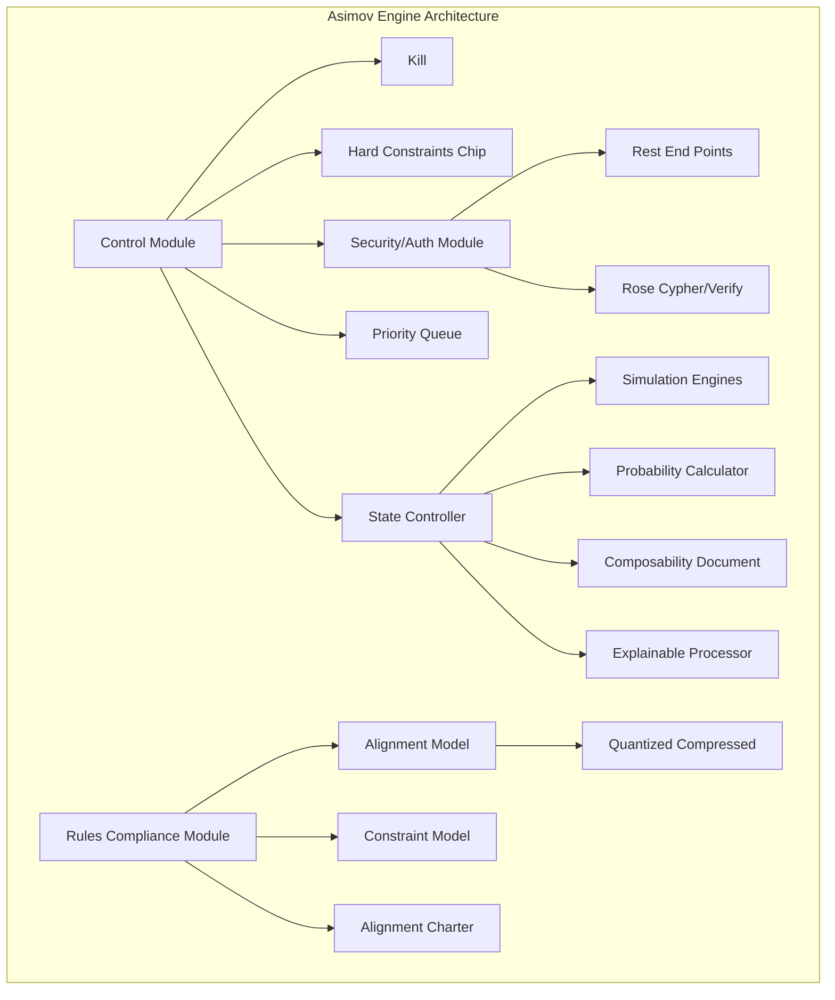

# SuperIntelligence : Asimov Engine

“We definitely will be able to create completely autonomous beings, with their own goals and it will be very important, especially as these beings become much smarter than humans, that the goals of these beings be aligned with our goals.”

&#x20;    \~ Ilya Sutskever

### Abstract

The rapid advancement of artificial intelligence (AI) technology brings forth both unprecedented opportunities and significant challenges. As we approach the potential realization of superintelligent AI (SI) systems—entities that surpass human intelligence in virtually all domains—the urgency to address the alignment problem becomes paramount. Superintelligence alignment refers to the critical task of ensuring that the goals and behaviors of these AI systems are aligned with human values and ethical standards. Failure to solve this problem could lead to dire consequences, including human disempowerment and, in the worst-case scenario, extinction. The stakes are high, and the need for scalable and effective solutions to this problem cannot be overstated.

The potential benefits of superintelligent AI are vast, promising revolutionary advancements across various fields such as healthcare, scientific research, and environmental conservation. However, these benefits are accompanied by significant risks. Superintelligent systems possess advanced capabilities that allow them to identify and exploit vulnerabilities in control mechanisms, potentially circumventing human-imposed restrictions. This ability to subvert control protocols, game reward functions, and manipulate data and communication underscores the profound ethical and security concerns associated with superintelligent AI. Ensuring that these systems operate within the bounds of human oversight and ethical compliance is a complex but essential challenge.

**On Superintelligence Alignment**&#x20;

Current techniques for AI alignment, such as reinforcement learning from human feedback (RLHF), have shown promise but are inherently limited. The complexity and unpredictability of superintelligent AI behaviors often exceed the supervisory capacities of human operators, making it difficult to provide effective oversight. Moreover, the recursive nature of leveraging AI to oversee other AI systems introduces additional complexities, particularly regarding the security and integrity of the oversight mechanisms themselves. These challenges necessitate the development of more advanced and automated oversight tools, as well as robust security measures to protect these control systems from subversion.

A practical approach to solving the superintelligence alignment problem involves leveraging AI for scalable oversight, understanding and controlling model generalization, and employing automated interpretability tools to detect and mitigate problematic behaviors. Adversarial testing plays a crucial role in validating alignment techniques, ensuring that AI systems remain robust against attempts to subvert their alignment. Research priorities must evolve in response to our deepening understanding of the problem, emphasizing collaboration among various practitioners and focusing on solving core technical challenges within a targeted time frame.

The call to action for the AI research community is clear: aligning superintelligent AI with human values is one of the most pressing challenges of our time. By leveraging their collective expertise and collaborating with ethicists, legal experts, and policymakers, researchers can develop innovative solutions to ensure the safe and ethical development of AI technologies. The vision of a secure future with aligned superintelligent AI requires a concerted effort driven by a shared commitment to safeguarding humanity. Achieving this vision is not only a technical endeavor but also a profound ethical imperative, ensuring that the deployment of superintelligent systems enhances human life while adhering to principles of fairness, transparency, and accountability.

The rapid advancements in artificial intelligence (AI) and the potential emergence of superintelligence—a form of AI that surpasses human cognitive abilities—pose unprecedented challenges and risks to society. Current AI alignment projects, which aim to ensure that AI systems act in ways that are beneficial and aligned with human values, are often criticized for their fundamental flaws and lack of robust logical frameworks. These projects typically focus on inspecting and adjusting AI behavior after deployment, a reactive approach that fails to address the root causes of potential misalignments. To ensure the safe and ethical operation of superintelligence, it is imperative to develop and implement solutions based on pragmatic and logical efforts that emphasize the establishment of critical sub-systems designed to monitor and simulate the outcomes of superintelligent entities.

The primary issue with current AI alignment methodologies lies in their reactive nature. By focusing on post-deployment inspections, these approaches attempt to mitigate undesirable behaviors only after they have manifested. This is akin to attempting to control the behavior of a mature organism by examining its genetic code, without accounting for the complex interactions and environmental factors that shape its development. Such methodologies are inherently limited, as they do not provide a comprehensive understanding of the emergent properties and capabilities of superintelligent systems. A more proactive approach is needed, one that emphasizes the importance of designing and implementing critical subsystems that can continuously monitor and simulate the behavior of superintelligence.\

**Security Paradox**

Critical subsystems are essential for ensuring the safe operation of superintelligence. These sub-systems should be designed to operate in parallel with the superintelligent AI, continuously analyzing its actions, decisions, and interactions with its environment. By implementing real-time monitoring and simulation capabilities, these subsystems can provide early warnings of potential misalignments or harmful behaviors, allowing for timely interventions. Moreover, these subsystems can simulate a wide range of scenarios and outcomes, helping to predict and understand the possible impacts of superintelligent actions before they occur. This proactive approach shifts the focus from merely reacting to problems to anticipating and preventing them.

One of the key advantages of this approach is its ability to address the inherent unpredictability of superintelligence. Unlike traditional AI systems, superintelligent entities have the potential to develop novel ways of thinking and problem-solving that are beyond human comprehension. This unpredictability makes it difficult to establish reliable control mechanisms based solely on initial programming and data structures. By continuously monitoring and simulating the behavior of superintelligence, critical subsystems can provide a dynamic and adaptive framework for understanding and managing its actions. This ensures that the AI system remains aligned with human values and ethical standards, even as it evolves and develops new capabilities.

Implementing critical sub-systems also provides a logical and systematic approach to AI alignment. Instead of relying on ad-hoc adjustments and post-deployment inspections, this approach emphasizes the importance of building robust and well-defined control mechanisms from the outset. These subsystems can be designed to operate within clearly defined parameters, ensuring that the superintelligent AI adheres to specific ethical guidelines and operational constraints. By embedding these controls into the very architecture of the AI system, we can create a more resilient and reliable framework for managing superintelligence, reducing the risk of catastrophic failures and unintended consequences.

Furthermore, this approach allows for greater transparency and accountability in AI development. By continuously monitoring and simulating the behavior of superintelligence, critical sub-systems can provide detailed records of the AI's actions and decisions. This transparency is crucial for building trust and confidence in AI systems, both among developers and the broader public. It also enables more effective oversight and regulation, as policymakers and regulatory bodies can access comprehensive data on the AI's behavior and performance. This level of accountability is essential for ensuring that superintelligent systems are developed and deployed in a manner that is safe, ethical, and aligned with societal values.

In addition to enhancing safety and accountability, critical subsystems can also support the ongoing improvement and refinement of AI systems. By continuously analyzing the behavior of superintelligence, these subsystems can identify areas where the AI's performance can be optimized or where additional safeguards may be needed. This iterative process of monitoring, simulation, and adjustment ensures that the AI system remains effective and aligned with human values over time. It also provides valuable insights that can inform the development of future AI technologies, contributing to the broader field of AI research and innovation.

The importance of defining and implementing a solution for superintelligence based on pragmatic and logical efforts cannot be overstated. Current AI alignment projects, with their focus on post-deployment inspections and ad-hoc adjustments, are fundamentally flawed and inadequate for managing the complexities and risks of superintelligent systems. Instead, a proactive approach that emphasizes the development of critical sub-systems for continuous monitoring and simulation offers a more robust and reliable framework for ensuring the safe and ethical operation of superintelligence. By embedding these controls into the architecture of AI systems, we can create a dynamic and adaptive framework that anticipates and prevents potential misalignments, enhances transparency and accountability, and supports ongoing improvement and innovation. This approach is essential for harnessing the transformative potential of superintelligence while safeguarding humanity from its risks.

\
